# VetrAI Platform Screenshots

This document provides visual examples of the VetrAI platform's frontend and backend interfaces.

## 📱 Frontend Screenshots

### Studio Dashboard (Port 3000)

The Studio interface is where users create and manage AI workflows using the LangFlow-based visual editor.

#### 1. Main Dashboard
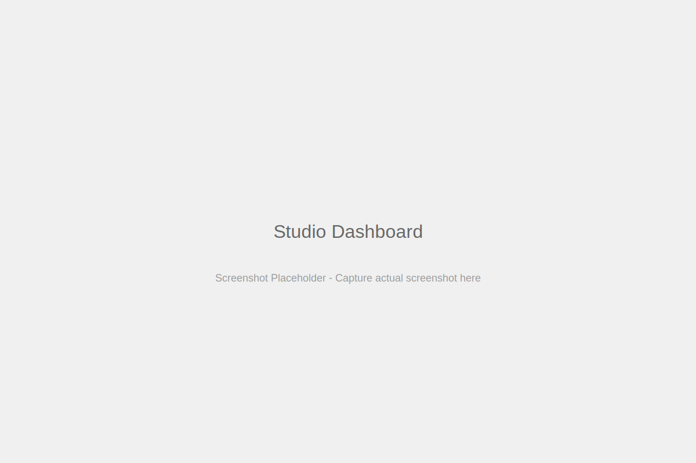
*The main Studio dashboard showing workflow overview and quick actions*

**Key Features Visible:**
- Workflow list and status
- Quick create buttons
- Recent activity feed
- User profile and settings access

#### 2. Workflow Builder
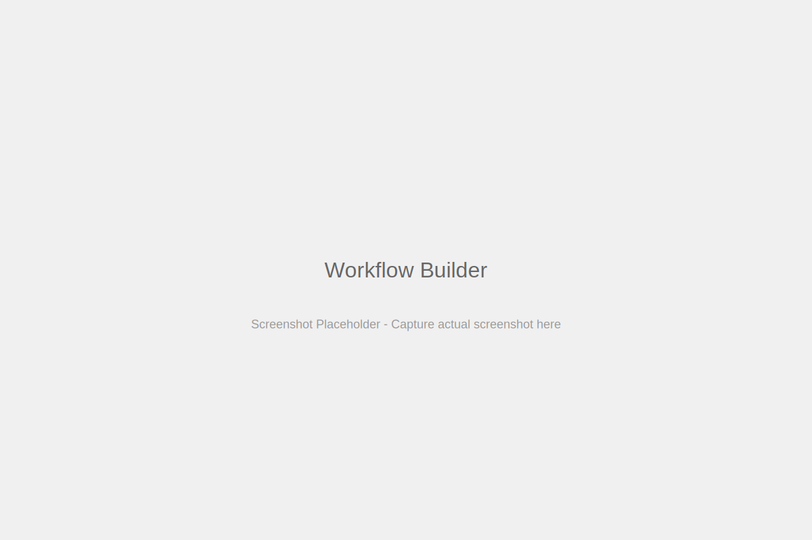
*Visual workflow editor with drag-and-drop interface*

**Key Features Visible:**
- Node palette with AI components
- Canvas for building workflows
- Connection lines between nodes
- Properties panel
- Testing and deployment controls

#### 3. Workflow Execution
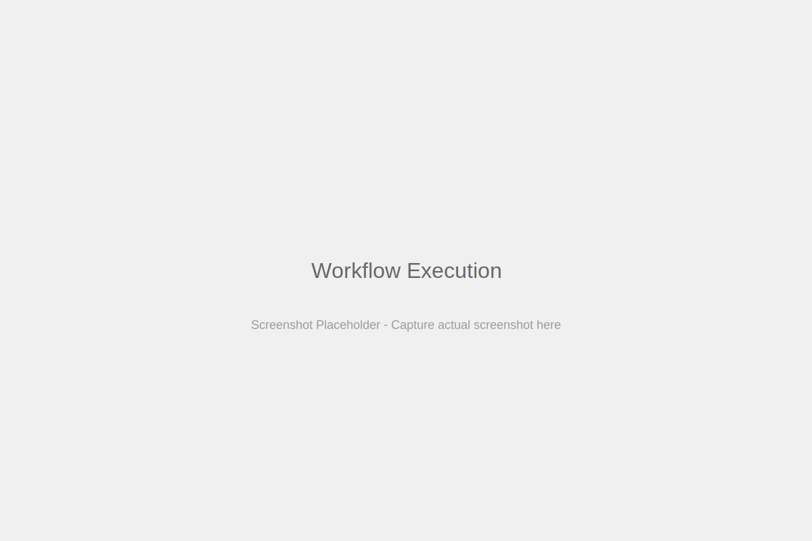
*Live workflow execution with real-time monitoring*

**Key Features Visible:**
- Execution status indicators
- Real-time logs
- Output viewer
- Error handling display

### Admin Dashboard (Port 3001)

The Admin Dashboard provides comprehensive management capabilities for the entire platform.

#### 4. Admin Overview

*Main admin dashboard with platform metrics*

**Key Features Visible:**
- Platform usage statistics
- Active users and organizations
- Revenue and billing metrics
- System health indicators

#### 5. Organization Management
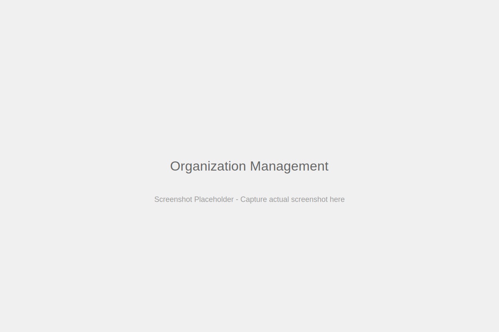
*Organization and tenant management interface*

**Key Features Visible:**
- Organization list with filters
- Plan assignments
- User count per organization
- Quick actions (edit, disable, delete)

#### 6. User Management
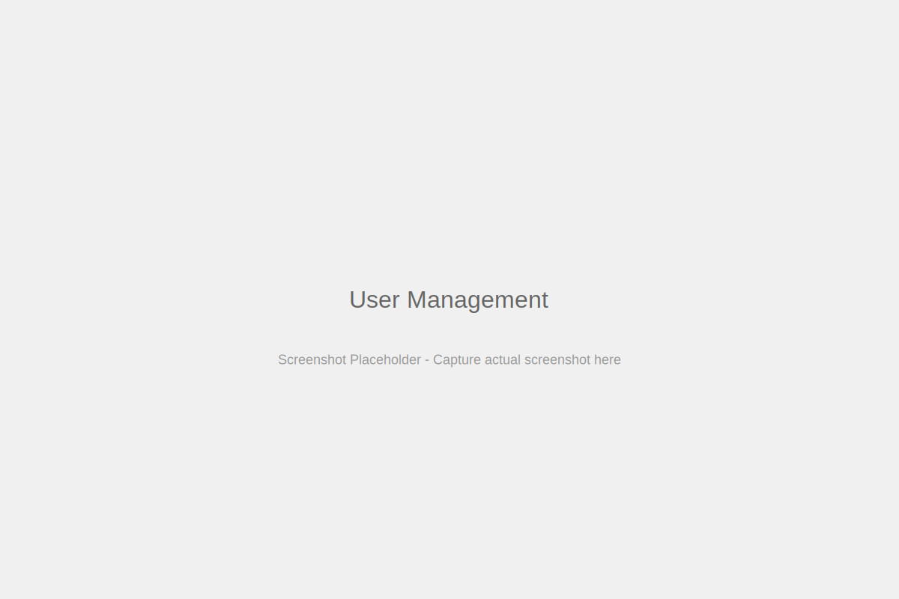
*User administration and role management*

**Key Features Visible:**
- User list with search and filters
- Role-based access control (RBAC) settings
- Status indicators (active, suspended)
- User activity logs

#### 7. API Keys Management
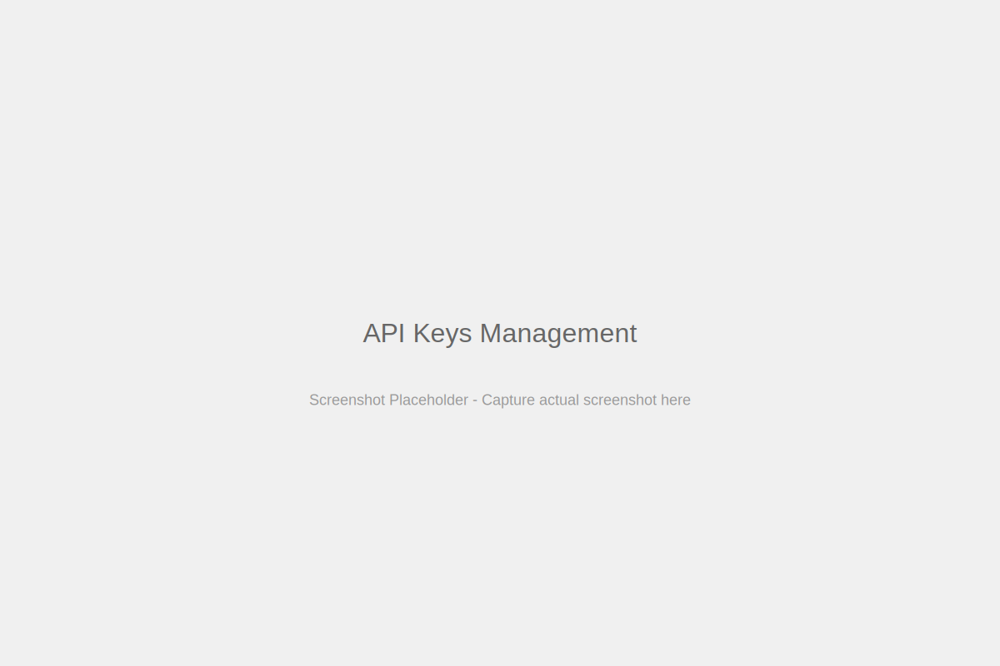
*API key generation and management*

**Key Features Visible:**
- Active API keys list
- Scoped permissions
- Rate limiting configuration
- Usage statistics per key

#### 8. Billing Dashboard
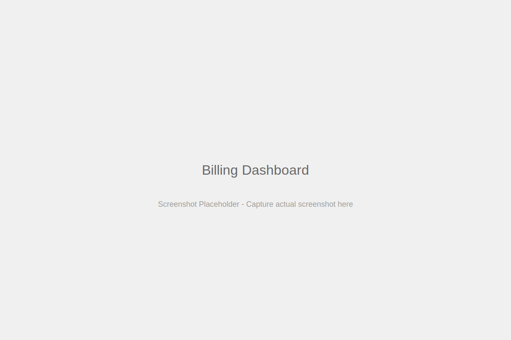
*Billing and subscription management*

**Key Features Visible:**
- Subscription plans
- Payment history
- Invoice generation
- Stripe integration status

#### 9. Support Tickets
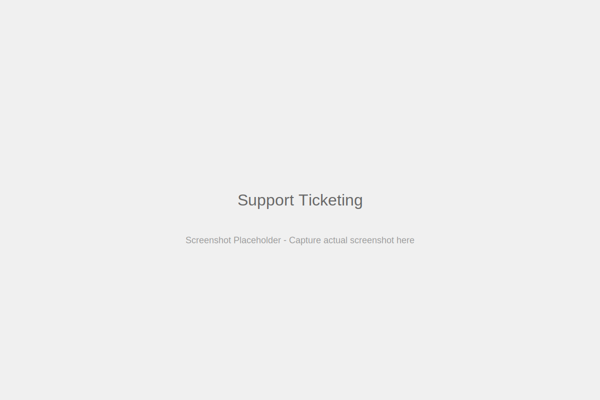
*Ticketing system interface*

**Key Features Visible:**
- Ticket list with priority indicators
- Status filters (open, in-progress, closed)
- Assignment management
- SLA tracking

#### 10. Theming & Branding
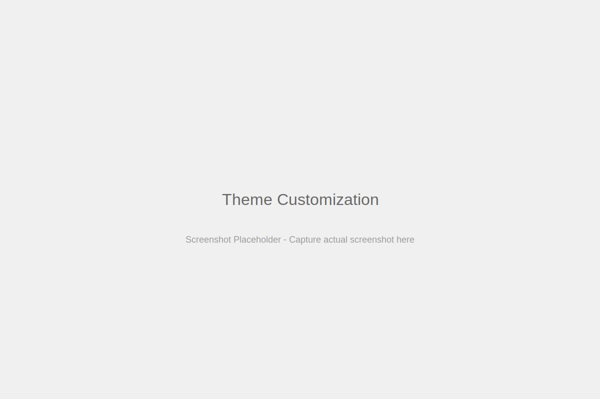
*Dynamic theme and branding configuration*

**Key Features Visible:**
- Color scheme editor
- Logo and favicon upload
- Custom CSS injection
- Preview panel

#### 11. Notifications Center

*Notification management interface*

**Key Features Visible:**
- Notification templates
- Channel configuration (Email, SMS, In-app)
- Delivery status tracking
- Template editor

## 🔧 Backend Screenshots

### API Documentation (Swagger UI)

#### 12. Authentication Service API (Port 8001)
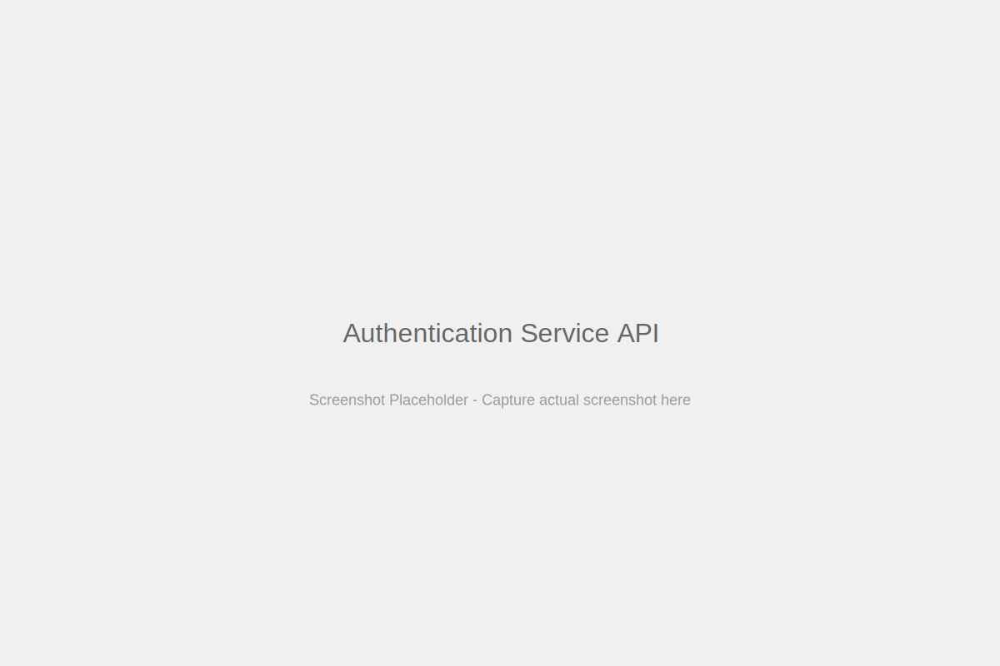
*Authentication service Swagger documentation*

**Available Endpoints:**
- POST `/api/v1/register` - User registration
- POST `/api/v1/login` - User authentication
- POST `/api/v1/refresh` - Token refresh
- GET `/api/v1/me` - Current user info
- GET `/api/v1/users` - User management (admin)

#### 13. Tenancy Service API (Port 8002)
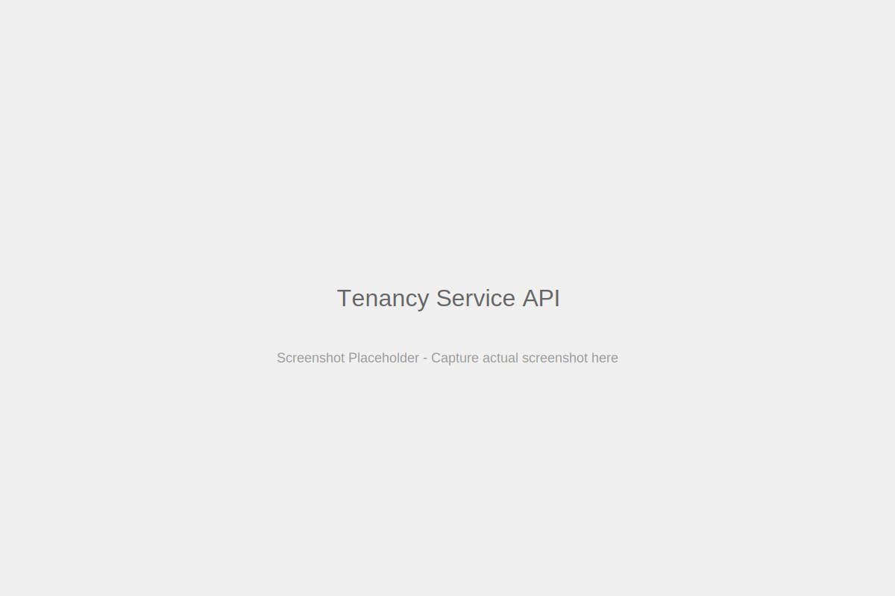
*Tenancy service Swagger documentation*

**Available Endpoints:**
- GET `/api/v1/organizations` - List organizations
- POST `/api/v1/organizations` - Create organization
- GET `/api/v1/organizations/{id}` - Get organization details
- PUT `/api/v1/organizations/{id}` - Update organization
- DELETE `/api/v1/organizations/{id}` - Delete organization

#### 14. API Keys Service (Port 8003)
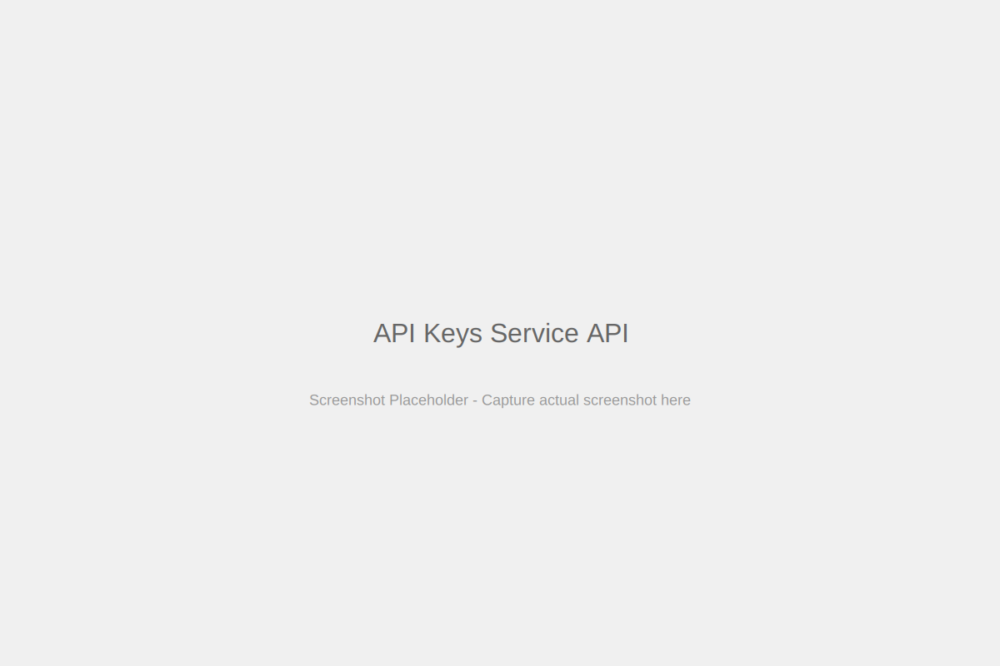
*API keys service Swagger documentation*

**Available Endpoints:**
- POST `/api/v1/keys` - Generate new API key
- GET `/api/v1/keys` - List API keys
- GET `/api/v1/keys/{id}` - Get key details
- PUT `/api/v1/keys/{id}` - Update key settings
- DELETE `/api/v1/keys/{id}` - Revoke API key
- GET `/api/v1/keys/{id}/usage` - Get usage statistics

#### 15. Billing Service API (Port 8004)
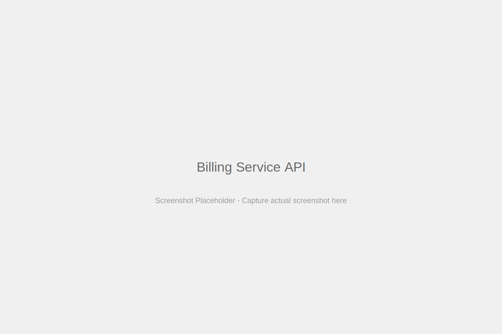
*Billing service Swagger documentation*

**Available Endpoints:**
- GET `/api/v1/billing/subscriptions` - List subscriptions
- POST `/api/v1/billing/subscriptions` - Create subscription
- GET `/api/v1/billing/invoices` - Get invoices
- POST `/api/v1/billing/webhooks/stripe` - Stripe webhook handler
- GET `/api/v1/billing/usage` - Get usage metrics

#### 16. Support Service API (Port 8005)

*Support service Swagger documentation*

**Available Endpoints:**
- GET `/api/v1/support/tickets` - List tickets
- POST `/api/v1/support/tickets` - Create ticket
- GET `/api/v1/support/tickets/{id}` - Get ticket details
- POST `/api/v1/support/tickets/{id}/comments` - Add comment
- POST `/api/v1/support/tickets/{id}/attachments` - Upload attachment

#### 17. Themes Service API (Port 8006)
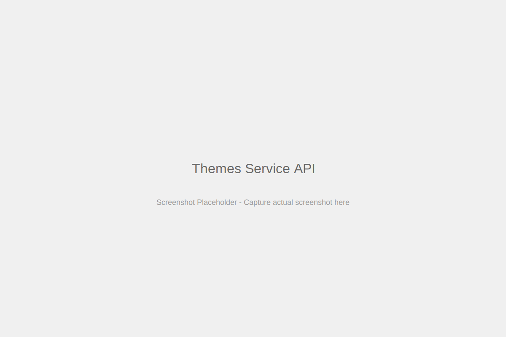
*Themes service Swagger documentation*

**Available Endpoints:**
- GET `/api/v1/themes` - Get current theme
- PUT `/api/v1/themes` - Update theme
- POST `/api/v1/themes/logo` - Upload logo
- GET `/api/v1/themes/pages` - List custom pages
- PUT `/api/v1/themes/pages` - Update page content

#### 18. Notifications Service API (Port 8007)

*Notifications service Swagger documentation*

**Available Endpoints:**
- GET `/api/v1/notifications` - List notifications
- POST `/api/v1/notifications/send` - Send notification
- GET `/api/v1/notifications/templates` - List templates
- POST `/api/v1/notifications/templates` - Create template
- PUT `/api/v1/notifications/templates/{id}` - Update template

#### 19. Workers Service API (Port 8008)

*Workers service Swagger documentation (LangGraph integration)*

**Available Endpoints:**
- POST `/api/v1/workers/jobs` - Submit workflow job
- GET `/api/v1/workers/jobs/{id}` - Get job status
- GET `/api/v1/workers/jobs` - List jobs
- GET `/api/v1/workers/templates` - List workflow templates
- POST `/api/v1/workers/templates` - Create template

## 🗺️ System Architecture Diagram

```
┌─────────────────────────────────────────────────────────────┐
│                        Load Balancer                         │
└─────────────────────────────────────────────────────────────┘
                              │
         ┌────────────────────┼────────────────────┐
         │                    │                    │
    ┌────▼─────┐        ┌────▼─────┐        ┌────▼─────┐
    │  Studio  │        │  Admin   │        │  Public  │
    │ Frontend │        │Dashboard │        │ Website  │
    │  :3000   │        │  :3001   │        │          │
    └────┬─────┘        └────┬─────┘        └────┬─────┘
         │                   │                    │
         └───────────────────┼────────────────────┘
                             │
                    ┌────────▼─────────┐
                    │   API Gateway    │
                    └────────┬─────────┘
                             │
         ┌───────────────────┼───────────────────┐
         │                   │                   │
    ┌────▼─────┐      ┌─────▼──────┐     ┌─────▼──────┐
    │   Auth   │      │  Tenancy   │     │    Keys    │
    │ :8001    │      │   :8002    │     │   :8003    │
    └──────────┘      └────────────┘     └────────────┘
         │                   │                   │
    ┌────▼─────┐      ┌─────▼──────┐     ┌─────▼──────┐
    │ Billing  │      │  Support   │     │   Themes   │
    │ :8004    │      │   :8005    │     │   :8006    │
    └──────────┘      └────────────┘     └────────────┘
         │                   │                   │
    ┌────▼─────┐      ┌─────▼──────┐
    │Notification│     │  Workers   │
    │  :8007    │     │   :8008    │
    └───────────┘     └────────────┘
         │                   │
         └───────────────────┼───────────────────┘
                             │
         ┌───────────────────┼───────────────────┐
         │                   │                   │
    ┌────▼─────┐      ┌─────▼──────┐     ┌─────▼──────┐
    │PostgreSQL│      │   Redis    │     │   MinIO    │
    │  :5432   │      │   :6379    │     │ :9000/:9001│
    └──────────┘      └────────────┘     └────────────┘
```

## 📊 Monitoring & Analytics

#### 20. Grafana Dashboard (Port 3002)
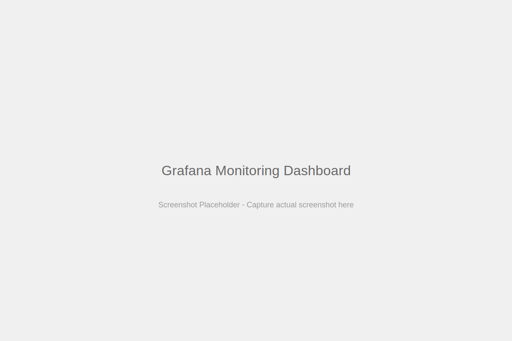
*Grafana monitoring dashboard with platform metrics*

**Key Metrics Visible:**
- API request rate and latency
- Service health status
- Database performance
- Cache hit rates
- Error rates per service

#### 21. Prometheus Metrics (Port 9090)
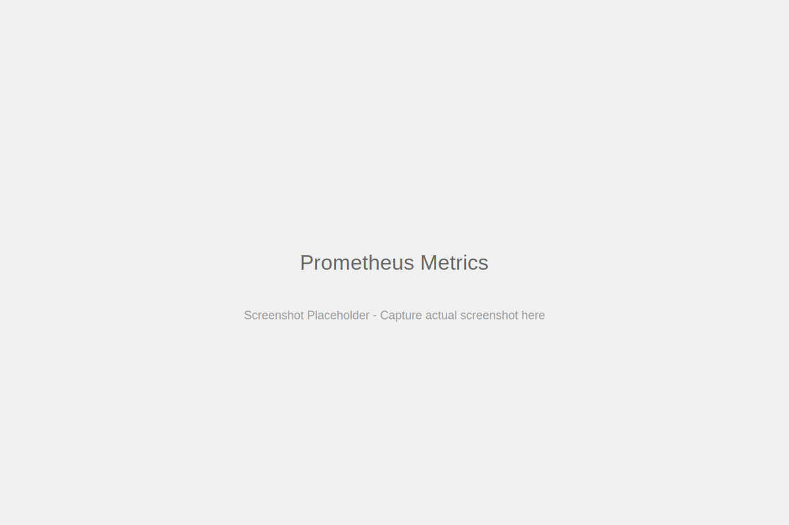
*Prometheus metrics collection interface*

**Available Metrics:**
- HTTP request duration
- Database connection pool status
- Redis operations
- Celery job queue length
- Custom business metrics

## 🎯 Key Features Highlighted

### Multi-Tenancy
- Organization-level data isolation
- Per-tenant customization
- Centralized administration

### Security
- JWT + refresh token authentication
- Role-based access control (RBAC)
- API key management with scoping
- Rate limiting per key/endpoint

### Scalability
- Microservices architecture
- Horizontal scaling support
- Redis caching layer
- Celery distributed task queue

### Developer Experience
- Comprehensive API documentation
- Interactive Swagger UI for all services
- OpenAPI/JSON specifications
- SDK generation support

## 📝 How to Capture Screenshots

To capture actual screenshots of your VetrAI platform:

1. **Start the platform:**
   ```bash
   docker compose up -d
   ```

2. **Wait for all services to be healthy:**
   ```bash
   docker compose ps
   ```

3. **Access the interfaces:**
   - Studio: http://localhost:3000
   - Admin Dashboard: http://localhost:3001
   - API Docs (Auth): http://localhost:8001/docs
   - API Docs (Tenancy): http://localhost:8002/docs
   - API Docs (Keys): http://localhost:8003/docs
   - API Docs (Billing): http://localhost:8004/docs
   - API Docs (Support): http://localhost:8005/docs
   - API Docs (Themes): http://localhost:8006/docs
   - API Docs (Notifications): http://localhost:8007/docs
   - API Docs (Workers): http://localhost:8008/docs
   - Grafana: http://localhost:3002
   - Prometheus: http://localhost:9090

4. **Capture screenshots** of each interface and save them to the respective directories:
   - Frontend screenshots: `docs/screenshots/frontend/`
   - Backend screenshots: `docs/screenshots/backend/`

5. **Update this document** by replacing the placeholder text with actual descriptions based on your screenshots.

## 🔗 Related Documentation

- [Architecture Guide](architecture/README.md)
- [API Documentation](api/README.md)
- [Deployment Guide](deployment/README.md)
- [Quick Start Guide](QUICKSTART.md)

---

*Last updated: 2025-12-10*
